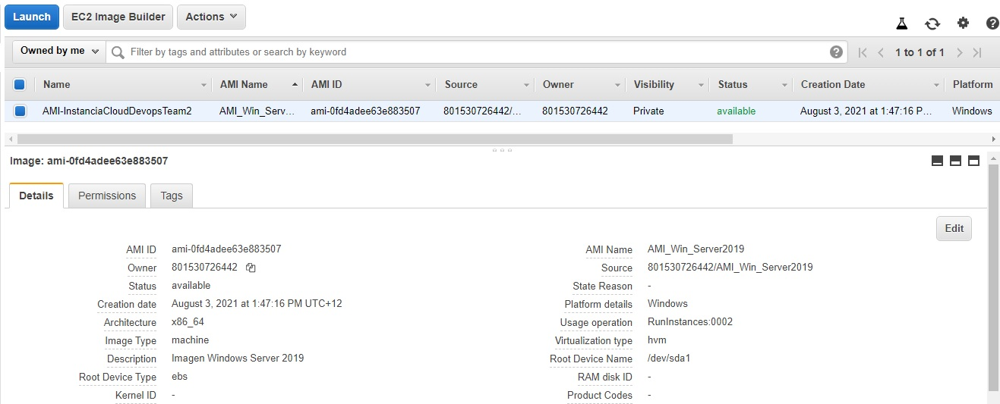

# Tarea 3

- [x]  Creación de cuenta gratuita en Amazon Web Services, Google Cloud Platform y Microsoft Azure.
- [x]  Crear en AWS : 1 instancia con windows Server 2019, con RDP, un Security Group abierto a internet, Zona de disponibilidad A de South America, El nombre debe ser "InstanciaCloudDevopsTeam" + nomreb del Team, Debe tener los Tags (Año, Sistema Operativo, Nombre de Equipo, Carrera, Institucion(EducacionIT), Proyecto(Carrera clouddevops), Tag del entorno(Develoment), Disco EBS de 30gb
- [x]  Actualizar Trello con capturas de la instancia creada y dirección IP
- [x]  Crear en AWS : 1 instancia con Windows Server2012, con RDP, un Security group abierto a internet, en la zona de disponibilidad B de South América, el nombre debe ser “InstanciaCloudDevopsTeam” + nombre del Team, esta instancia debe tener los tags (año, sistema operativo, nombre del equipo, carrera, institución(EducacionIT), proyecto(carrera clouddevops) , también el tag del entorno (Stage), Disco EBS de 30 gb.
- [x]  Actualizar Trello con capturas de la instancia creada y dirección IP
- [x]  Crear en AWS : 1 instancia con Windows Server 2016, con EC2, del tipo t2.micro (el único disponible en la capa gratuita), con RDP, un Security group abierto a internet, en la zona de disponibilidad C de South América, el nombre debe ser “InstanciaCloudDevopsTeam” + nombre del Team , esta instancia debe tener los tags (año, sistema operativo, nombre del equipo, carrera, institución(EducacionIT), proyecto (carrera clouddevops) , también el tag de entorno (Produccion), Disco EBS de 30 gb,
- [x]  Actualizar Trello con capturas de la instancia creada y dirección IP
- [x]  DevTeam : Crear una AMI (Amazon Machine Image) de la instancia de Windows Server 2019, cambiarle el fondo para demostrar que el equipo lo creo (pueden usar logotipos o diseñar un propio Wallpaper)
- [x]  Dentro de la AMI creada previamente: se deben instalar las siguientes herramientas: Docker(ultima version), WAMP, Kubernetes, Visual Studio, el ejecutable de Terraform, Jenkins(ultima version), GIT
- [x]  Actualizar Trello y el repositorio con las tareas realizadas.

Capturas:

