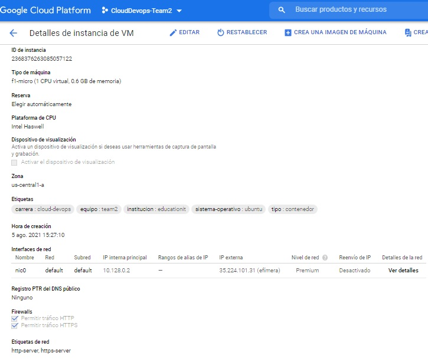
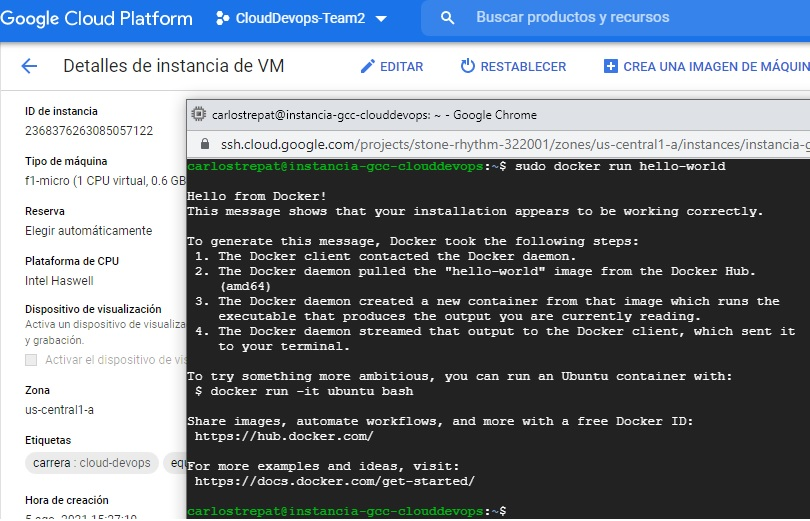

# Tarea 4

- [x]  Crear en GCP : 1 instancia del tipo F1-micro, de primera generación de Ubuntu
 con Contenedores en Google Cloud Platform, Disco de 100gb, 
accesibilidad desde cualquier dirección IP del mundo, nombre de la VM 
debe ser "InstanciaGCPCloudDevops", debe tener los Tags (Tipo: 
Contenedor, Sistema Operativo: Ubuntu, Equipo: Team "X", Carrera: 
CloudDevops, Institución: EducacionIT)
- [x]  Cargar capturas de que la instancia fue creada con los parámetros especificados y que la instancia tiene Docker instalado.

Capturas:

