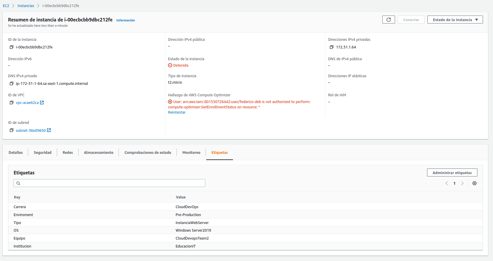
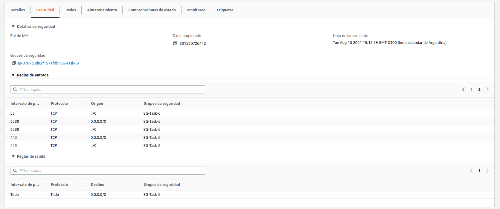
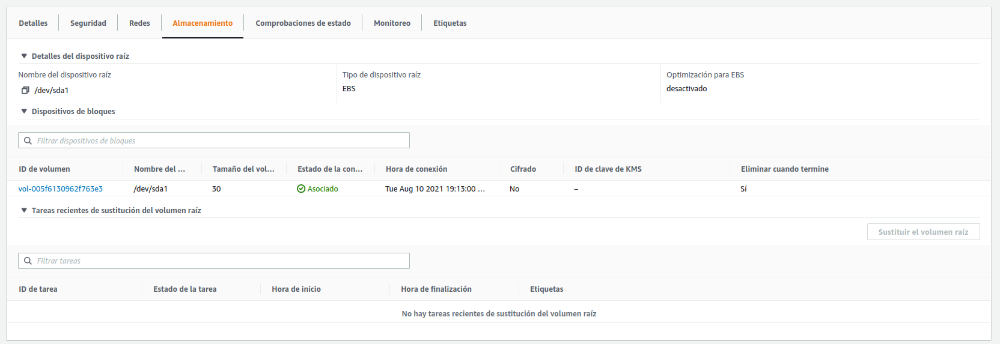

# Tarea 6

- [x]  Carlos realizara la siguiente tarea: Desplegar de manera manual la aplicación que el profesor suministro, en 1 servidor en AWS, utilizando EC2, Creando una Instancia de Windows Server 2019 t2.micro, que tenga instalado IIS o en su defecto, WAMP, para así disponer de un servidor Web, en el , simplemente copiaremos nuestro código en el web server, y visitaremos localhost para identificar que la aplicación se encuentra en la nube en una Instancia. La instancia debe ser creada con acceso RDP desde cualquier dirección IP , también debe tener un disco EBS de 30gb, con un disco de SSD de 3era Generación.
- [x]  Tags que deben tener: Tipo: InstanciaWebServer / OS: Windows Server2019 / Equipo: CloudDevopsTeam2 / Carrera: CloudDevOps / Institución: EducacionIT / Environment: Pre-Production
- [x]  Federico se encargara de actualizar el status de esta tarea en Trello y también en Github

Capturas:

